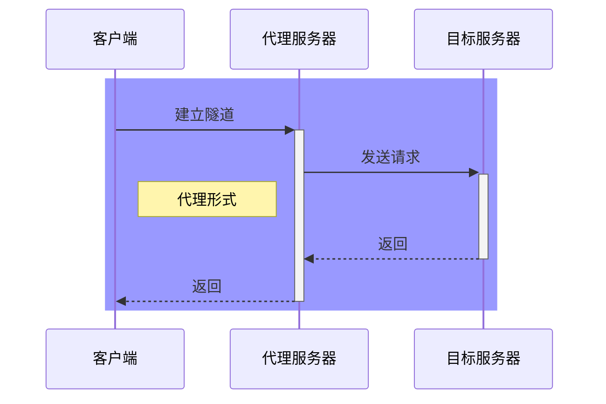

### 代理形式[^5]

客户端和代理服务之间的连接形式，主要有如下：

- HTTP 代理：使用 HTTP 协议进行代理。
- HTTPS 代理：使用 HTTPS 协议进行代理，通常用于代理 HTTPS 网站。
- SOCKS 代理：使用 SOCKS 协议进行代理，支持 TCP 和 UDP 协议。
- SSH 代理：使用 SSH 协议进行代理，通常用于代理本地端口，建立安全的加密连接。

| **特点**               | HTTP        | HTTPs              | SOCKS4          | SOCKS5         | SSH                |
| ---------------------- | ----------- | ------------------ | --------------- | -------------- | ------------------ |
| **支持目标站点的协议** | HTTP/HTTPs  | HTTP/HTTPs         | 不关心协议      | 不关心协议     | 任何基于TCP的协议  |
| **所处的协议层**       | 应用层（7） | 应用层（7）        | 会话层[^2]（5） | 会话层（5）    | 应用层(7)          |
| **使用的传输协议**     | TCP/UDP[^1] | TCP/UDP            | TCP             | TCP/UDP        | TCP/UDP            |
| **速度**               | 快          | 慢                 | 很快[^3]        | 很快           | 慢                 |
| **安全性**             | 明文传输    | 安全，SSL/TLS 加密 | 明文传输        | 明文传输       | 安全，SSL/TLS 加密 |
| **匿名性**             | 完全匿名    | 完全匿名           | 取决于代理类型  | 取决于代理类型 | 不完全匿名         |

> 所处协议层[^4]越靠前，性能越好，功能越弱

[^1]: HTTP和HTTPS：HTTP/1 和 HTTP/2 支持 TCP，HTTP/3 支持UDP
[^2]:  [SOCKS - 维基百科，自由的百科全书](https://zh.wikipedia.org/zh-hans/SOCKS)
[^3]: 简简单单地传送数据包，没有多余的解析，所以速度很快
[^4]:  [网络协议——七层、五层、四层协议概念及功能分析 - 知乎](https://zhuanlan.zhihu.com/p/152590226)
[^5]:  [http、https、socks代理各自的优缺点都是什么？ - 知乎](https://www.zhihu.com/question/37983925)